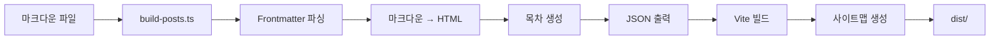

# Feature Specification: Blog (마크다운 기반 블로그 시스템)

**Feature Name**: `blog`
**작성일**: 2025-11-07
**Phase**: 신규 기능 개발
**관련 링크**:
- 태스크: TBD
- 피그마: TBD

---

## 1. 기능 개요

### 1.1 목적 및 설명
개인 포트폴리오 사이트에 마크다운 기반 블로그 시스템을 추가하여, 기술 블로그 글을 작성하고 공유할 수 있는 플랫폼을 제공합니다. 마크다운 파일을 기반으로 정적 사이트 생성(SSG) 방식을 사용하여, 빌드 시점에 모든 블로그 글을 HTML로 변환하고 SEO 최적화를 수행합니다.

### 1.2 사용자 스토리

#### 블로그 작성자 (개발자)
- ✍️ 마크다운 파일로 블로그 글을 작성하고, 파일을 추가하면 자동으로 블로그에 반영됩니다
- 🎨 YAML frontmatter로 메타데이터(제목, 날짜, 태그, 썸네일)를 관리합니다
- 💻 로컬 개발 환경에서 Hot Reload로 즉시 변경사항을 확인할 수 있습니다
- 📦 `draft: true` 설정으로 초안을 작성하고, 준비되면 배포할 수 있습니다

#### 블로그 독자 (방문자)
- 📋 블로그 목록 페이지에서 최신 글을 카드 형식으로 탐색합니다
- 🏷️ 태그로 필터링하여 관심 있는 주제의 글을 찾습니다
- 📖 깔끔한 타이포그래피와 코드 하이라이팅으로 글을 읽습니다
- 📑 긴 글에서 목차(TOC)를 통해 원하는 섹션으로 빠르게 이동합니다
- ⏱️ 읽기 예상 시간을 확인하고 글을 선택합니다

### 1.3 성공 지표 및 KPI
- ✅ 마크다운 파일 추가 → 빌드 → 블로그 글 자동 생성 (100% 자동화)
- ✅ SEO: 사이트맵 자동 생성, Open Graph 태그 적용
- ✅ 개발 경험: Hot Reload 지원, 타입 안전성 확보
- ✅ 성능: Lighthouse 점수 90점 이상 (Performance, Accessibility, SEO)
- ✅ 코드 품질: TypeScript strict mode, 단위 테스트 커버리지 80% 이상

---

## 2. 기술 요구사항

### 2.1 시스템 아키텍처

#### Module Federation 구조
```
apps/_shell (Host App, Port 3000)
├─ /blog/* → apps/blog (Remote App, Port 3002)
└─ Module Federation: 동적 로드

apps/blog (Remote App, Port 3002)
├─ Exposes: ./BlogRouter (라우터 컴포넌트)
├─ Exposes: ./BlogListPage (목록 페이지)
├─ Exposes: ./BlogPostPage (상세 페이지)
├─ 독립 실행 가능 (standalone)
└─ 빌드 시 마크다운 → JSON 변환
```

#### 디렉토리 구조
```
apps/blog/
├── src/
│   ├── pages/
│   │   ├── BlogListPage.vue      # 블로그 목록
│   │   └── BlogPostPage.vue      # 블로그 상세
│   ├── components/
│   │   ├── BlogCard.vue          # 글 카드 컴포넌트
│   │   ├── BlogTOC.vue           # 목차 컴포넌트
│   │   ├── MarkdownRenderer.vue  # 마크다운 렌더러
│   │   └── TagFilter.vue         # 태그 필터
│   ├── composables/
│   │   ├── useBlogPosts.ts       # 블로그 데이터 로직
│   │   ├── useMarkdown.ts        # 마크다운 처리
│   │   └── useTOC.ts             # 목차 생성
│   ├── types/
│   │   └── blog.ts               # TypeScript 타입 정의
│   ├── utils/
│   │   ├── markdown.ts           # 마크다운 유틸
│   │   ├── readingTime.ts        # 읽기 시간 계산
│   │   └── seo.ts                # SEO 유틸
│   ├── router.ts                 # 블로그 라우터
│   ├── App.vue                   # 블로그 앱 루트
│   └── main.ts                   # 앱 진입점
├── posts/                        # 📝 마크다운 파일
│   ├── 2025-01-01-my-first-post.md
│   ├── 2025-01-07-vue3-tips.md
│   └── drafts/                   # 초안 폴더
│       └── wip-article.md
├── public/
│   ├── images/                   # 블로그 이미지
│   │   ├── thumbnails/
│   │   └── posts/
│   └── sitemap.xml               # 빌드 시 생성
├── scripts/
│   ├── build-posts.ts            # 빌드 스크립트 (MD → JSON)
│   └── generate-sitemap.ts       # 사이트맵 생성
├── vite.config.ts                # Vite + Module Federation
├── vitest.config.ts
├── package.json
└── tsconfig.json
```

### 2.2 TypeScript 타입 정의

```typescript
// apps/blog/src/types/blog.ts

export interface BlogPostFrontmatter {
  title: string;
  date: string; // ISO 8601 format (YYYY-MM-DD)
  tags: string[];
  description: string;
  thumbnail?: string; // 선택적
  draft?: boolean; // 기본값: false
  author?: string; // 기본값: "Jeongwoo Ahn"
}

export interface BlogPost {
  id: string; // 파일명 기반 slug (예: "my-first-post")
  slug: string; // URL slug (예: "my-first-post")
  frontmatter: BlogPostFrontmatter;
  content: string; // 마크다운 원본
  html: string; // 렌더링된 HTML
  readingTime: number; // 분 단위
  toc: TableOfContentsItem[]; // 목차
}

export interface TableOfContentsItem {
  level: number; // 1, 2, 3 (H1, H2, H3)
  text: string;
  id: string; // anchor ID
}

export interface BlogMetadata {
  posts: BlogPost[];
  tags: string[]; // 모든 태그 목록
  totalPosts: number;
  lastUpdated: string; // ISO 8601
}
```

### 2.3 기술 스택 선정

| 카테고리 | 기술 | 버전 | 목적 |
|---------|------|------|------|
| **Core** | Vue 3 | 3.5.13 | UI 프레임워크 |
| | TypeScript | 5.6.3 | 타입 안전성 |
| | Vite | 6.0.3 | 빌드 도구 |
| **Module Federation** | @module-federation/vite | 최신 | 마이크로 프론트엔드 |
| **마크다운** | markdown-it | ^14.1.0 | 마크다운 파서 |
| | markdown-it-anchor | ^9.2.0 | 제목 anchor 생성 |
| | markdown-it-attrs | ^4.2.0 | CSS 클래스 추가 |
| | gray-matter | ^4.0.3 | YAML frontmatter 파싱 |
| **코드 하이라이팅** | shiki | ^1.22.0 | 구문 강조 (VSCode 엔진) |
| **스타일** | Tailwind CSS | 3.4.17 | CSS 프레임워크 |
| | @tailwindcss/typography | ^0.5.15 | 마크다운 스타일 (prose) |
| **유틸** | date-fns | ^4.1.0 | 날짜 포맷팅 |
| | reading-time | ^1.5.0 | 읽기 시간 계산 |
| **SEO** | sitemap | ^8.0.0 | 사이트맵 생성 |
| **테스트** | Vitest | 3.2.4 | 단위 테스트 |
| | @vue/test-utils | 2.4.6 | Vue 컴포넌트 테스트 |

### 2.4 라우터 구성

#### Shell 앱 라우터 (_shell/src/router.ts)
```typescript
const routes: RouteRecordRaw[] = [
  // 기존 라우트
  { path: '/', component: () => import('helloWorld/App') },
  { path: '/hello', component: () => import('helloWorld/App') },
  { path: '/home', component: () => import('helloWorld/App') },

  // 블로그 라우트 추가 (Module Federation)
  {
    path: '/blog',
    component: () => import('blog/BlogRouter'), // Remote 라우터
    children: [
      // blog 앱 내부에서 처리
    ]
  },
];
```

#### 블로그 앱 라우터 (blog/src/router.ts)
```typescript
const routes: RouteRecordRaw[] = [
  {
    path: '',
    name: 'BlogList',
    component: BlogListPage,
  },
  {
    path: ':slug',
    name: 'BlogPost',
    component: BlogPostPage,
    props: true,
  },
  {
    path: 'tag/:tag',
    name: 'BlogTagFilter',
    component: BlogListPage,
    props: true,
  },
];
```

**URL 구조**:
- `/blog` → 블로그 목록
- `/blog/my-first-post` → 글 상세
- `/blog/tag/vue` → 태그 필터

### 2.5 상태 관리 방식
- **전역 상태**: 불필요 (각 페이지에서 데이터 fetch)
- **Composables**: `useBlogPosts()`, `useMarkdown()` 등으로 로직 재사용
- **Props Drilling**: 최소화 (Provide/Inject 사용 가능)

### 2.6 빌드 프로세스



**빌드 단계**:
1. `pnpm build:posts` → `scripts/build-posts.ts` 실행
   - `posts/**/*.md` 스캔 (초안 제외)
   - Frontmatter + 마크다운 파싱
   - HTML 렌더링 + 코드 하이라이팅
   - `src/generated/posts.json` 생성
2. `vite build` → Vue 앱 빌드
3. `pnpm build:sitemap` → `scripts/generate-sitemap.ts` 실행
   - `posts.json` 읽기
   - `public/sitemap.xml` 생성

### 2.7 스타일 시스템
- **Tailwind CSS Typography Plugin**: `prose` 클래스로 마크다운 스타일
- **다크모드**: `dark:` variant 적용 (기존 ShellLayout 다크모드와 통합)
- **커스텀 스타일**: `apps/blog/src/styles/markdown.css` (필요 시)

### 2.8 로깅 및 모니터링
- **개발 환경**: `console.log` 사용
- **프로덕션**: CloudFlare Web Analytics (선택적)
- **에러 추적**: 브라우저 콘솔 (Sentry 통합은 Phase 2)

---

## 3. 테스트 전략

### 3.1 단위 테스트 (Vitest)

#### 컴포넌트 테스트
```typescript
// apps/blog/src/components/__tests__/BlogCard.spec.ts
import { mount } from '@vue/test-utils';
import BlogCard from '../BlogCard.vue';

describe('BlogCard', () => {
  it('제목, 날짜, 태그를 렌더링한다', () => {
    const wrapper = mount(BlogCard, {
      props: {
        post: {
          slug: 'test-post',
          frontmatter: {
            title: 'Test Post',
            date: '2025-01-07',
            tags: ['vue', 'typescript'],
            description: 'Test description',
          },
          readingTime: 5,
        },
      },
    });

    expect(wrapper.text()).toContain('Test Post');
    expect(wrapper.text()).toContain('2025-01-07');
    expect(wrapper.text()).toContain('vue');
  });
});
```

#### Composable 테스트
```typescript
// apps/blog/src/composables/__tests__/useBlogPosts.spec.ts
import { describe, it, expect } from 'vitest';
import { useBlogPosts } from '../useBlogPosts';

describe('useBlogPosts', () => {
  it('모든 블로그 글을 반환한다', () => {
    const { posts } = useBlogPosts();
    expect(posts.value.length).toBeGreaterThan(0);
  });

  it('태그로 필터링한다', () => {
    const { filterByTag } = useBlogPosts();
    const filtered = filterByTag('vue');
    expect(filtered.every(p => p.frontmatter.tags.includes('vue'))).toBe(true);
  });
});
```

#### 유틸 함수 테스트
```typescript
// apps/blog/src/utils/__tests__/readingTime.spec.ts
import { calculateReadingTime } from '../readingTime';

describe('calculateReadingTime', () => {
  it('읽기 시간을 계산한다 (200 words ≈ 1분)', () => {
    const text = 'word '.repeat(200);
    const time = calculateReadingTime(text);
    expect(time).toBe(1);
  });
});
```

### 3.2 통합 테스트
```typescript
// apps/blog/src/pages/__tests__/BlogPostPage.spec.ts
import { mount } from '@vue/test-utils';
import { createRouter, createMemoryHistory } from 'vue-router';
import BlogPostPage from '../BlogPostPage.vue';

describe('BlogPostPage', () => {
  it('slug에 해당하는 글을 렌더링한다', async () => {
    const router = createRouter({
      history: createMemoryHistory(),
      routes: [{ path: '/blog/:slug', component: BlogPostPage }],
    });

    await router.push('/blog/my-first-post');
    const wrapper = mount(BlogPostPage, {
      global: { plugins: [router] },
    });

    expect(wrapper.text()).toContain('My First Post');
  });
});
```

### 3.3 E2E 테스트 (Phase 2)
- Playwright를 사용한 브라우저 테스트
- 블로그 목록 → 상세 → 뒤로가기 흐름 검증

### 3.4 테스트 커버리지 목표
- **함수**: 80% 이상
- **라인**: 75% 이상
- **브랜치**: 70% 이상

---

## 4. 작업 계획 (Work Plan)

### Phase 1: 환경 설정 및 블로그 앱 구조 생성 (예상: 2-3시간)

#### 1.1 블로그 앱 생성 및 Module Federation 설정 (1시간)
**상세 설명**:
- `apps/blog/` 디렉토리 생성
- `package.json`, `vite.config.ts`, `tsconfig.json` 구성
- Module Federation Remote 설정 (`exposes: { './BlogRouter': './src/router.ts' }`)
- Shell 앱에 `blog` Remote 추가

**선행 조건**:
- 기존 Module Federation 구조 이해
- hello-world 앱 참고

**산출물**:
- `apps/blog/package.json`
- `apps/blog/vite.config.ts` (Module Federation 설정)
- `apps/_shell/vite.config.ts` (blog Remote 추가)

**검증 방법**:
```bash
pnpm --filter blog dev  # Port 3002에서 독립 실행
pnpm dev:all:blog       # Shell + blog 병렬 실행
```

#### 1.2 디렉토리 구조 및 TypeScript 설정 (30분)
**상세 설명**:
- `src/pages/`, `src/components/`, `src/composables/` 등 생성
- `src/types/blog.ts` 타입 정의 작성
- Tailwind CSS 설정 (`darkMode: 'class'`)

**산출물**:
- 디렉토리 구조 완성
- `src/types/blog.ts`
- `tailwind.config.js`

**검증 방법**:
```bash
pnpm --filter blog type-check  # TypeScript 컴파일 성공
```

#### 1.3 의존성 설치 및 Vitest 설정 (30분)
**상세 설명**:
- `markdown-it`, `shiki`, `gray-matter` 등 설치
- `vitest.config.ts` 구성
- 샘플 테스트 작성 및 실행

**산출물**:
- `apps/blog/package.json` (의존성 추가)
- `apps/blog/vitest.config.ts`
- `src/components/__tests__/sample.spec.ts`

**검증 방법**:
```bash
pnpm --filter blog test  # 테스트 통과
```

---

### Phase 2: 마크다운 처리 시스템 개발 (예상: 4-5시간)

#### 2.1 마크다운 파서 및 렌더러 구현 (2시간)
**상세 설명**:
- `src/utils/markdown.ts` 작성
  - `markdown-it` 초기화 (플러그인: anchor, attrs)
  - `shiki` 코드 하이라이팅 통합
  - `gray-matter`로 frontmatter 파싱
- `src/composables/useMarkdown.ts` 작성
  - 마크다운 → HTML 변환 composable

**선행 조건**:
- 의존성 설치 완료

**산출물**:
- `src/utils/markdown.ts`
- `src/composables/useMarkdown.ts`
- 단위 테스트: `src/utils/__tests__/markdown.spec.ts`

**검증 방법**:
```typescript
import { parseMarkdown } from '@/utils/markdown';
const result = parseMarkdown('# Hello\n\n```js\nconst a = 1;\n```');
expect(result.html).toContain('<h1>Hello</h1>');
expect(result.html).toContain('<code class="shiki">');
```

#### 2.2 목차(TOC) 생성 로직 (1시간)
**상세 설명**:
- `src/utils/toc.ts` 작성
  - HTML에서 `<h2>`, `<h3>` 추출
  - `id` 속성 기반 anchor 링크 생성
- `src/composables/useTOC.ts` 작성

**산출물**:
- `src/utils/toc.ts`
- `src/composables/useTOC.ts`
- 단위 테스트: `src/utils/__tests__/toc.spec.ts`

**검증 방법**:
```typescript
const toc = generateTOC('<h2 id="intro">Intro</h2><h3 id="detail">Detail</h3>');
expect(toc).toEqual([
  { level: 2, text: 'Intro', id: 'intro' },
  { level: 3, text: 'Detail', id: 'detail' },
]);
```

#### 2.3 읽기 시간 계산 (30분)
**상세 설명**:
- `src/utils/readingTime.ts` 작성
  - `reading-time` 라이브러리 래핑 또는 직접 구현
  - 한국어/영어 혼용 고려 (평균 200 words/min)

**산출물**:
- `src/utils/readingTime.ts`
- 단위 테스트: `src/utils/__tests__/readingTime.spec.ts`

**검증 방법**:
```typescript
const time = calculateReadingTime('word '.repeat(200));
expect(time).toBe(1); // 1분
```

#### 2.4 빌드 스크립트 작성 (1.5시간)
**상세 설명**:
- `scripts/build-posts.ts` 작성
  - `posts/**/*.md` 파일 스캔 (glob)
  - Frontmatter + 마크다운 파싱
  - HTML 렌더링, TOC, 읽기 시간 계산
  - `src/generated/posts.json` 생성
  - 초안(`draft: true`) 제외

**산출물**:
- `scripts/build-posts.ts`
- `src/generated/posts.json` (빌드 시 생성)
- `package.json` 스크립트: `"build:posts": "tsx scripts/build-posts.ts"`

**검증 방법**:
```bash
pnpm --filter blog build:posts
cat apps/blog/src/generated/posts.json  # JSON 확인
```

---

### Phase 3: 블로그 UI 컴포넌트 개발 (예상: 5-6시간)

#### 3.1 BlogCard 컴포넌트 (1시간)
**상세 설명**:
- 카드 레이아웃: 썸네일(선택), 제목, 날짜, 태그, 설명, 읽기 시간
- 호버 효과: 그림자 강조
- 다크모드 스타일

**Props**:
```typescript
interface Props {
  post: BlogPost;
}
```

**산출물**:
- `src/components/BlogCard.vue`
- 단위 테스트: `src/components/__tests__/BlogCard.spec.ts`

**검증 방법**:
- 스토리북 또는 독립 페이지에서 확인
- 테스트 통과

#### 3.2 MarkdownRenderer 컴포넌트 (1.5시간)
**상세 설명**:
- Props로 HTML 받아서 렌더링
- Tailwind Typography `prose` 클래스 적용
- 코드 블록 스타일링 (Shiki 테마)
- 이미지 lazy loading

**Props**:
```typescript
interface Props {
  html: string;
}
```

**산출물**:
- `src/components/MarkdownRenderer.vue`
- 단위 테스트: `src/components/__tests__/MarkdownRenderer.spec.ts`

#### 3.3 BlogTOC 컴포넌트 (1시간)
**상세 설명**:
- 목차 트리 렌더링 (중첩 리스트)
- 현재 섹션 하이라이트 (Intersection Observer)
- sticky positioning (사이드바)

**Props**:
```typescript
interface Props {
  toc: TableOfContentsItem[];
}
```

**산출물**:
- `src/components/BlogTOC.vue`
- 단위 테스트: `src/components/__tests__/BlogTOC.spec.ts`

#### 3.4 TagFilter 컴포넌트 (1시간)
**상세 설명**:
- 모든 태그 목록 표시
- 선택된 태그 강조
- 클릭 시 라우터 이동 (`/blog/tag/:tag`)

**Props**:
```typescript
interface Props {
  tags: string[];
  selectedTag?: string;
}
```

**산출물**:
- `src/components/TagFilter.vue`
- 단위 테스트: `src/components/__tests__/TagFilter.spec.ts`

#### 3.5 Composables 작성 (1.5시간)
**상세 설명**:
- `useBlogPosts.ts`: posts.json 로드 및 필터링
- `useMarkdown.ts`: 마크다운 처리 래퍼
- `useTOC.ts`: 목차 생성 래퍼

**산출물**:
- `src/composables/useBlogPosts.ts`
- `src/composables/useMarkdown.ts`
- `src/composables/useTOC.ts`
- 단위 테스트 각각

**검증 방법**:
```bash
pnpm --filter blog test:unit
```

---

### Phase 4: 블로그 페이지 개발 (예상: 4-5시간)

#### 4.1 BlogListPage (목록 페이지) (2시간)
**상세 설명**:
- 헤더: 제목, 부제
- 태그 필터 (TagFilter 컴포넌트)
- 그리드 레이아웃 (반응형: 1/2/3열)
- 페이지네이션 (10개씩, 더보기 버튼)
- 로딩/에러 상태 처리

**레이아웃**:
```
┌────────────────────────────────────┐
│  📝 Blog                           │
│  태그: [All] [Vue] [TypeScript]    │
├────────────────────────────────────┤
│  ┌──────┐  ┌──────┐  ┌──────┐     │
│  │Card 1│  │Card 2│  │Card 3│     │
│  └──────┘  └──────┘  └──────┘     │
│  ┌──────┐  ┌──────┐  ┌──────┐     │
│  │Card 4│  │Card 5│  │Card 6│     │
│  └──────┘  └──────┘  └──────┘     │
│           [더보기]                 │
└────────────────────────────────────┘
```

**산출물**:
- `src/pages/BlogListPage.vue`
- 통합 테스트: `src/pages/__tests__/BlogListPage.spec.ts`

**검증 방법**:
- `/blog` 접속 → 글 목록 표시
- 태그 클릭 → 필터링 확인

#### 4.2 BlogPostPage (상세 페이지) (2.5시간)
**상세 설명**:
- 헤더: 제목, 날짜, 태그, 읽기 시간
- 2열 레이아웃 (Desktop)
  - 왼쪽: MarkdownRenderer (prose)
  - 오른쪽: BlogTOC (sticky)
- 1열 레이아웃 (Mobile/Tablet)
  - TOC 상단 접기 가능
- 이전/다음 글 네비게이션
- 404 처리 (slug 없음)

**레이아웃**:
```
Desktop:
┌─────────────────────────┬──────┐
│  # Title                │ TOC  │
│  Date | Tags | 5 min    │ - H2 │
│  ────────────────────── │ - H2 │
│  Content (prose)        │ - H3 │
│  ...                    │      │
│  ────────────────────── │      │
│  [← Prev] [Next →]      │      │
└─────────────────────────┴──────┘
```

**산출물**:
- `src/pages/BlogPostPage.vue`
- 통합 테스트: `src/pages/__tests__/BlogPostPage.spec.ts`

**검증 방법**:
- `/blog/my-first-post` 접속 → 글 렌더링
- TOC 클릭 → 해당 섹션 스크롤
- 존재하지 않는 slug → 404

---

### Phase 5: 라우팅 통합 및 Module Federation 연결 (예상: 2-3시간)

#### 5.1 블로그 앱 라우터 설정 (1시간)
**상세 설명**:
- `src/router.ts` 작성
  - `/` → BlogListPage
  - `/:slug` → BlogPostPage
  - `/tag/:tag` → BlogListPage (props)
- `src/App.vue` 작성 (router-view)

**산출물**:
- `src/router.ts`
- `src/App.vue`
- `src/main.ts`

**검증 방법**:
```bash
pnpm --filter blog dev  # 독립 실행
# localhost:3002 → 목록
# localhost:3002/my-first-post → 상세
```

#### 5.2 Shell 앱에 블로그 Remote 추가 (1시간)
**상세 설명**:
- `apps/_shell/vite.config.ts`에 `blog` Remote 추가
- `apps/_shell/src/router.ts`에 `/blog` 라우트 추가
- 환경변수 설정 (`.env.development`, `.env.production`)

**산출물**:
- `apps/_shell/vite.config.ts` (blog Remote)
- `apps/_shell/src/router.ts` (/blog 라우트)
- `apps/_shell/.env.development` (`VITE_BLOG_URL=http://localhost:3002`)

**검증 방법**:
```bash
pnpm dev:all:blog  # Shell + hello + blog 동시 실행
# localhost:3000/blog → 블로그 목록
# localhost:3000/blog/my-first-post → 상세
```

#### 5.3 ShellLayout 네비게이션 업데이트 (30분)
**상세 설명**:
- `packages/ui/src/ShellLayout.vue`의 "Blog" 링크 활성화
- 활성 라우트 하이라이트 확인

**산출물**:
- `packages/ui/src/ShellLayout.vue` (Blog 링크 활성화)

**검증 방법**:
- 네비게이션에서 "Blog" 클릭 → `/blog` 이동
- 활성 상태 하이라이트 확인

---

### Phase 6: SEO 및 사이트맵 (예상: 2-3시간)

#### 6.1 사이트맵 생성 스크립트 (1.5시간)
**상세 설명**:
- `scripts/generate-sitemap.ts` 작성
  - `src/generated/posts.json` 읽기
  - 각 글마다 `<url>` 항목 생성
  - `public/sitemap.xml` 출력
- `package.json` 스크립트: `"build:sitemap": "tsx scripts/generate-sitemap.ts"`

**사이트맵 형식**:
```xml
<?xml version="1.0" encoding="UTF-8"?>
<urlset xmlns="http://www.sitemaps.org/schemas/sitemap/0.9">
  <url>
    <loc>https://jeongwoo.in/blog</loc>
    <lastmod>2025-01-07</lastmod>
    <priority>1.0</priority>
  </url>
  <url>
    <loc>https://jeongwoo.in/blog/my-first-post</loc>
    <lastmod>2025-01-01</lastmod>
    <priority>0.8</priority>
  </url>
</urlset>
```

**산출물**:
- `scripts/generate-sitemap.ts`
- `public/sitemap.xml` (빌드 시 생성)

**검증 방법**:
```bash
pnpm --filter blog build:sitemap
cat apps/blog/public/sitemap.xml
```

#### 6.2 Open Graph 메타 태그 (1시간)
**상세 설명**:
- `src/utils/seo.ts` 작성
  - `useHead()` composable (VueUse 또는 직접 구현)
  - OG 태그: title, description, image, type, url
- BlogPostPage에서 각 글마다 동적 메타 태그 설정

**메타 태그 예시**:
```html
<meta property="og:title" content="My First Blog Post" />
<meta property="og:description" content="블로그 글 요약..." />
<meta property="og:image" content="https://jeongwoo.in/images/thumbnails/post1.jpg" />
<meta property="og:type" content="article" />
<meta property="og:url" content="https://jeongwoo.in/blog/my-first-post" />
```

**산출물**:
- `src/utils/seo.ts`
- BlogPostPage에 메타 태그 적용

**검증 방법**:
- Facebook Sharing Debugger 또는 Twitter Card Validator로 확인
- 개발자 도구에서 `<head>` 태그 확인

#### 6.3 robots.txt 생성 (30분)
**상세 설명**:
- `public/robots.txt` 작성
  - 모든 크롤러 허용
  - 사이트맵 URL 명시

**robots.txt**:
```
User-agent: *
Allow: /

Sitemap: https://jeongwoo.in/sitemap.xml
```

**산출물**:
- `apps/blog/public/robots.txt`

**검증 방법**:
```bash
curl https://jeongwoo.in/robots.txt
```

---

### Phase 7: 테스트 및 품질 보증 (예상: 3-4시간)

#### 7.1 단위 테스트 작성 (2시간)
**상세 설명**:
- 모든 컴포넌트 단위 테스트
- 모든 유틸 함수 단위 테스트
- Composables 테스트
- 커버리지 80% 달성

**검증 방법**:
```bash
pnpm --filter blog test:coverage
# Coverage: 80% 이상
```

#### 7.2 통합 테스트 (1시간)
**상세 설명**:
- BlogListPage, BlogPostPage 통합 테스트
- 라우팅 테스트
- Module Federation 로드 테스트 (mocked)

**검증 방법**:
```bash
pnpm --filter blog test
# All tests pass
```

#### 7.3 수동 QA 테스트 (1시간)
**체크리스트**:
- [ ] 블로그 목록 페이지 렌더링
- [ ] 태그 필터링 동작
- [ ] 블로그 상세 페이지 렌더링
- [ ] 마크다운 → HTML 변환 정확성
- [ ] 코드 하이라이팅 작동
- [ ] 목차(TOC) 클릭 → 스크롤
- [ ] 다크모드 전환
- [ ] 반응형 레이아웃 (모바일/태블릿/데스크톱)
- [ ] Module Federation 로드 (Shell 앱에서)
- [ ] 사이트맵 생성 확인
- [ ] OG 태그 확인 (SNS 미리보기)

---

### Phase 8: 문서화 및 배포 준비 (예상: 2시간)

#### 8.1 README 작성 (1시간)
**상세 설명**:
- `apps/blog/README.md` 작성
  - 프로젝트 개요
  - 블로그 글 작성 방법 (마크다운 가이드)
  - 빌드 및 배포 방법
  - 로컬 개발 방법

**산출물**:
- `apps/blog/README.md`

#### 8.2 CLAUDE.md 업데이트 (30분)
**상세 설명**:
- `.claude/CLAUDE.md`에 Phase 6 추가
  - 완료 항목 체크리스트
  - 검증 결과
  - 프로젝트 구조 업데이트

**산출물**:
- `.claude/CLAUDE.md` (Phase 6 섹션)

#### 8.3 배포 설정 (30분)
**상세 설명**:
- `apps/blog/wrangler.toml` 작성 (CloㅇudFlare Pages)
- `package.json` 스크립트 추가
  - `"build": "pnpm build:posts && vite build && pnpm build:sitemap"`
  - `"preview": "vite preview"`

**산출물**:
- `apps/blog/wrangler.toml`
- `package.json` (빌드 스크립트)

**검증 방법**:
```bash
pnpm --filter blog build
pnpm --filter blog preview
# localhost:4173 접속 확인
```

---

## 5. 위험 및 고려사항

### 5.1 기술적 위험

| 위험 | 확률 | 영향 | 완화 전략 |
|------|------|------|----------|
| **마크다운 빌드 시간 증가** (글 100개+) | 중간 | 중간 | - 캐싱 시스템 (변경된 파일만 재빌드)<br>- 병렬 처리 (`p-limit`) |
| **Module Federation 타입 에러** | 낮음 | 높음 | - `vite-env.d.ts`에 타입 선언 추가<br>- 철저한 타입 체크 |
| **Shiki 번들 크기 증가** | 높음 | 중간 | - Tree-shaking 설정<br>- 필요한 언어만 로드<br>- Dynamic import |
| **사이트맵 생성 실패** (잘못된 URL) | 낮음 | 중간 | - 단위 테스트로 검증<br>- URL validation |
| **다크모드 스타일 충돌** | 낮음 | 낮음 | - Tailwind Typography 커스터마이징<br>- CSS 우선순위 관리 |

### 5.2 외부 의존성

| 의존성 | 목적 | 대체 가능 여부 |
|--------|------|---------------|
| **markdown-it** | 마크다운 파싱 | ✅ (remark, marked) |
| **shiki** | 코드 하이라이팅 | ✅ (Prism.js, highlight.js) |
| **@module-federation/vite** | Module Federation | ❌ (핵심 아키텍처) |
| **Tailwind CSS** | 스타일링 | ✅ (CSS-in-JS, Vanilla CSS) |
| **gray-matter** | Frontmatter 파싱 | ✅ (직접 구현 가능) |

### 5.3 시니어 검토 필요 영역

- [ ] **Module Federation 아키텍처**: Remote 앱 설계 검토
- [ ] **빌드 스크립트 성능**: 대량 마크다운 파일 처리 최적화
- [ ] **SEO 전략**: 사이트맵, robots.txt, OG 태그 검증
- [ ] **보안**: XSS 방어 (마크다운 렌더링 시 sanitization)
- [ ] **번들 크기**: Shiki, markdown-it 최적화

### 5.4 가정 및 미확정 요소

**가정**:
- ✅ 블로그 글은 개발자가 직접 마크다운 파일로 작성
- ✅ 댓글, 좋아요 기능은 Phase 2로 연기
- ✅ 검색 기능은 Phase 2로 연기
- ✅ RSS 피드는 Phase 2로 연기
- ✅ 이미지는 로컬 `public/images/`에 저장 (외부 CDN 미사용)

**미확정**:
- ❓ 블로그 글 개수 예상치 (50개? 100개? 성능 테스트 필요)
- ❓ CloudFlare Pages 배포 시 사이트맵 업로드 방법
- ❓ 구글 서치 콘솔 등록 절차 (별도 작업 필요)

---

## 6. 체크리스트

### 6.1 개발 전 확인사항
- [ ] Module Federation 구조 이해 완료
- [ ] hello-world 앱 참고하여 구조 파악
- [ ] 마크다운 샘플 파일 준비 (3-5개)
- [ ] 썸네일 이미지 준비

### 6.2 개발 중 확인사항
- [ ] TypeScript strict mode 준수
- [ ] 단위 테스트 작성 (각 함수/컴포넌트마다)
- [ ] ESLint 검사 통과
- [ ] 다크모드 스타일 적용
- [ ] 반응형 레이아웃 확인 (모바일/태블릿/데스크톱)

### 6.3 완료 후 확인사항
- [ ] `pnpm turbo build` 성공
- [ ] `pnpm turbo test` 성공 (커버리지 80%+)
- [ ] `pnpm turbo type-check` 성공
- [ ] `pnpm dev:all:blog` 동작 확인
- [ ] `/blog`, `/blog/:slug` 접속 확인
- [ ] 사이트맵 생성 확인 (`/sitemap.xml`)
- [ ] OG 태그 확인 (SNS 미리보기 테스트)
- [ ] Lighthouse 점수 90+ (Performance, Accessibility, SEO)

---

## 7. 참고 자료

### 7.1 프로젝트 내부 문서
- `.claude/CLAUDE.md` - 프로젝트 히스토리
- `.claude/spec-20251014-module-federation-shell.md` - Module Federation 아키텍처
- `apps/_shell/vite.config.ts` - Shell 앱 설정 참고

### 7.2 외부 문서
- [markdown-it GitHub](https://github.com/markdown-it/markdown-it)
- [Shiki Documentation](https://shiki.style/)
- [Module Federation Vite](https://github.com/module-federation/vite)
- [Tailwind Typography](https://tailwindcss.com/docs/typography-plugin)
- [Sitemaps.org](https://www.sitemaps.org/protocol.html)
- [Open Graph Protocol](https://ogp.me/)

### 7.3 디자인 참고
- 현재 프로필 페이지 스타일 (hello-world 앱)
- Tailwind CSS 공식 블로그: https://tailwindcss.com/blog
- Nuxt Content 예제: https://nuxt.com/blog

---

## 8. 예상 타임라인

| Phase | 예상 시간 | 누적 시간 |
|-------|----------|----------|
| Phase 1: 환경 설정 | 2-3시간 | 2-3시간 |
| Phase 2: 마크다운 처리 | 4-5시간 | 6-8시간 |
| Phase 3: UI 컴포넌트 | 5-6시간 | 11-14시간 |
| Phase 4: 페이지 개발 | 4-5시간 | 15-19시간 |
| Phase 5: 라우팅 통합 | 2-3시간 | 17-22시간 |
| Phase 6: SEO 및 사이트맵 | 2-3시간 | 19-25시간 |
| Phase 7: 테스트 및 QA | 3-4시간 | 22-29시간 |
| Phase 8: 문서화 및 배포 | 2시간 | 24-31시간 |

**총 예상 시간**: 24-31시간 (3-4일, 1일 8시간 기준)

---

## 9. 성공 기준

### 9.1 기능적 요구사항
- ✅ 마크다운 파일 → 블로그 글 자동 생성
- ✅ 블로그 목록 페이지 (카드 그리드, 태그 필터)
- ✅ 블로그 상세 페이지 (마크다운 렌더링, 목차, 코드 하이라이팅)
- ✅ URL 구조: `/blog`, `/blog/:slug`, `/blog/tag/:tag`
- ✅ 사이트맵 자동 생성 (`/sitemap.xml`)
- ✅ Open Graph 태그 적용

### 9.2 비기능적 요구사항
- ✅ TypeScript strict mode (타입 안전성)
- ✅ 단위 테스트 커버리지 80% 이상
- ✅ Lighthouse 점수 90+ (Performance, Accessibility, SEO)
- ✅ 다크모드 지원
- ✅ 반응형 레이아웃 (모바일/태블릿/데스크톱)
- ✅ Module Federation 독립 실행 가능

### 9.3 개발자 경험
- ✅ Hot Reload (마크다운 수정 → 즉시 반영)
- ✅ 초안 기능 (`draft: true`)
- ✅ 타입 안전성 (TypeScript)
- ✅ 명확한 문서화 (README, 주석)

---

## 10. Next Steps (Phase 2 이후)

### 향후 확장 계획
- 🔍 **검색 기능**: Fuse.js 또는 Algolia 통합
- 💬 **댓글 시스템**: Giscus (GitHub Discussions)
- 📡 **RSS 피드**: `/rss.xml` 생성
- 📊 **조회수 추적**: CloudFlare Analytics 또는 Google Analytics
- 🎨 **이미지 최적화**: CloudFlare Images 또는 `vite-plugin-image-optimizer`
- 🌐 **다국어 지원**: Vue I18n (한국어/영어)
- 📱 **PWA**: Service Worker, Manifest

---

**명세서 작성 완료일**: 2025-11-07
**작성자**: Feature Specification Architect (Claude Code)
**버전**: 1.0.0
